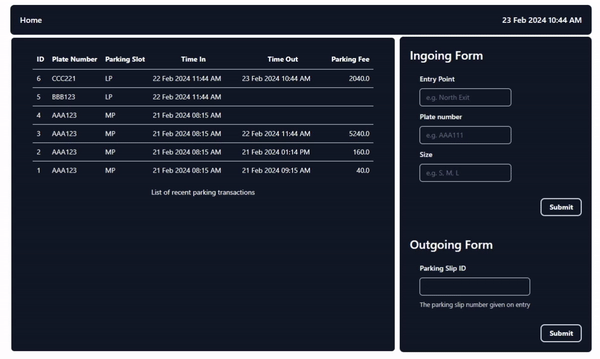
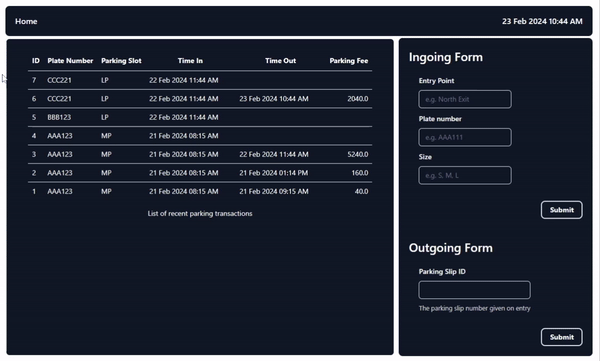

<h1 align="center">OOPs Parking</h1>

Simple parking allocation webapp written in Ruby and Javascript.

<br>


## 📖 Table of Contents ##

- [Technologies](#technologies)
- [Prerequisites](#prerequisites)
- [Getting Started](#getting_started)
- [Usage](#usage)


## 🚀 Technologies ##

- [Rails](https://rubyonrails.org/)
- [React](https://pt-br.reactjs.org/)
- [shadcn/ui](https://ui.shadcn.com/)
- [TailwindCSS](https://tailwindcss.com/)

## :white_check_mark: Prerequisites ##

Before starting, you need to install the folowing dependencies:

| Dependency | Version | Notes |
| ---------- | ------- | ----- |
| Ruby       | 3.2.0   | setup with [rbenv](https://github.com/rbenv/rbenv#readme) |
| Rails      | 7.1.3   |                                                           |
| Node       | v21.6.1 | install with [nvm](https://github.com/nvm-sh/nvm)         |
| Yarn       | 1.22.21 |                                                           |
| SQLite3    | 3.31.1  |                                                           |

## :checkered_flag: Getting Started ##

```bash
# Clone this project
$ git clone https://github.com/robertcbsg/oops_napark.git

# Access
$ cd oops_napark

# Install dependencies
$ bundle install
$ yarn install

# Initiate the database
$ rails db:migrate
$ rails db:seed

# Run the project
$ bin/dev

# The server will initialize in the <http://localhost:3000>
```

## ⚙️ Usage ##
### Parking / Unparking
1. **Parking**. Fill up the ingoing form with the entry point and vehicle details, on submit the parking slip is added on the list of transactions.



2. **Unparking**. Fill up the outgoing form with the parking slip #, on submit the parking fee is filled up on the corresponding transaction.



### Configuring the Parking Lot

For admin actions, such as adding entry points and setting up the parking lot map, we can access the API.
1. **Entry Points**. To setup the Parking Lot, let's add the entry points first.

#### POST | `/api/v1/parking/entry_points`
```json
{
    "entry_points": [
        {
           "name": "Seventh exit"
        },
        {
           "name": "8th park ave."
        }
    ]
}
```

2. **Parking Slots**. Then we can add the Parking Slots with the corresponding distance array.

#### POST | `/api/v1/parking/slots`
```json
{
    "size": "SP",
    "distance_from_entries": [
        {
            "name": "north exit",
            "distance": 1
        },
        {
            "name": "west exit",
            "distance": 4
        },
        {
            "name": "Southwest exit",
            "distance": 2
        }
    ]
}
```

3. **Clock**. For demo purposes, instead of using the system's time we have the 'Clock' table. This way we can 'move' time by simply calling the clock API.

#### POST | `/api/v1/clock`
```json
{
    "hours": 0,
    "minutes": 1
}
```


<a href="#top">Back to top</a>
